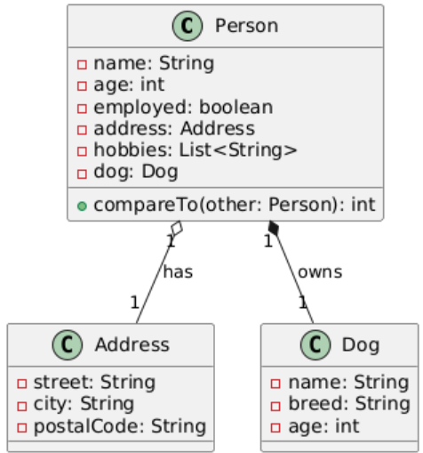

### Daten-Generierung

Für die Erzeugung von Testdaten wurde die Bibliothek **JavaFaker** verwendet. JavaFaker generiert realistische aber zufällige Daten wie Namen, Adressen, Hobbys und weitere Details. Um dabei reproduzierbare Ergebnisse zu erhalten, wurde ein **fester Seed** für den Zufallsgenerator gesetzt. Dadurch erzeugt die Datenquelle bei jedem Programmstart dieselben Daten, was wichtig für konsistente Tests und Debugging ist.

Der Ablauf zur Daten-Generierung:

- Ein `Faker`-Objekt wird mit einem festen `Random`-Seed initialisiert.
- Für jede zu erzeugende Person werden mit `faker` Attribute generiert.
- Diese Daten werden in Java-Objekte der Klassen `Person`, `Address` und `Dog` gesetzt.
- Es wird eine Liste von Personen erzeugt, die anschließend für Sortier- oder Testzwecke genutzt werden kann.

Dieser Ansatz vermeidet das manuelle Erstellen von Dummy-Daten und sorgt für realistische und vielfältige Testobjekte.

---

### Klassendiagramm der Datenklassen

**Erklärung:**
- `Person` hat ein Attribut vom Typ `Address` (Aggregation).
- `Person` besitzt eine Liste von Hobbys (Strings).
- `Person` hat ein zugehöriges `Dog`-Objekt (Komposition).
- `Address` enthält typische Adressdaten wie Street, City und PostalCode.
- `Dog` hat Attribute wie Name, Breed und Age.

Diese Struktur erlaubt eine realistische Modellierung von Personen mit komplexeren Attributen und ermöglicht Sortierungen über verschiedene Ebenen (z.B. nach Hundenamen, Stadt oder Alter).

---

### Zusammenfassung

Durch die Kombination von JavaFaker mit einem festen Seed und der klaren Klassenstruktur konnten wir einfach und reproduzierbar realistische Testdaten erzeugen. Diese sind die Basis für unsere Sortierbeispiele und weitere Funktionalitäten im Projekt.

### Java – Wie funktioniert das genaue? Was macht Java?

Java ist eine objektorientierte Programmiersprache, die Bytecode erzeugt, der auf der Java Virtual Machine (JVM) läuft. Die JVM sorgt dafür, dass Java-Code plattformunabhängig ausgeführt werden kann. Java verwaltet Speicher automatisch (Garbage Collection) und bietet eine umfangreiche Standardbibliothek. Es unterstützt Konzepte wie Klassen, Objekte, Vererbung, Polymorphie, Interfaces, Exception Handling und Multithreading, wodurch vielseitige Anwendungen realisiert werden können.

---

### Wie wendet Java die Natural-Order einer Klasse beim Sortieren an?

Java verwendet die Schnittstelle `Comparable<T>`, um die natürliche Reihenfolge von Objekten zu definieren. Die Klasse implementiert dafür die Methode `compareTo(T o)`, die beschreibt, wie zwei Objekte verglichen werden. Wenn ein Sortierverfahren wie `Collections.sort()` oder `stream.sorted()` verwendet wird, nutzt Java diese `compareTo`-Methode automatisch, um die Reihenfolge festzulegen.

Beispiel:  
""  
public class Person implements Comparable<Person> {  
@Override  
public int compareTo(Person other) {  
return this.name.compareTo(other.name);  
}  
}  
""

---

### Wie wendet Java die Reverse-Order an eine Klasse beim Sortieren an?

Die umgekehrte Reihenfolge wird durch Verwendung von `Comparator.reverseOrder()` realisiert. Dabei wird die natürliche Reihenfolge invertiert. Das kann bei allen Objekten angewendet werden, die `Comparable` implementieren. Alternativ können auch eigene Comparator-Implementierungen verwendet und mit `.reversed()` umgedreht werden.

Beispiele:  
""  
Collections.sort(list, Comparator.reverseOrder());  
""  
oder mit Streams:  
""  
list.stream().sorted(Comparator.reverseOrder())  
""

---

### Wie sortiert Java?

Java verwendet intern für primitive Datentypen einen Dual-Pivot Quicksort, der sehr effizient ist. Für Objekte wird meistens der TimSort-Algorithmus eingesetzt, der eine Kombination aus Merge Sort und Insertion Sort ist. TimSort ist besonders gut geeignet für teilweise sortierte Daten, was häufig in der Praxis vorkommt. Java nutzt die Vergleichsfunktionen (`compareTo` oder `Comparator`), um Elemente zu vergleichen und entsprechend anzuordnen.

---

### Wie löst Java das Sortieren?

Java delegiert die Sortierlogik an das Interface `Comparable` oder an externe `Comparator`-Objekte. Dadurch kann man flexibel bestimmen, nach welchen Kriterien sortiert wird (z.B. Name, Alter, Stadt). Intern verwendet Java diese Vergleichsmethoden, um Elemente zu ordnen. Komplexe Sortierungen, wie mehrstufige Sortierungen (Comparator Chain), können durch Verkettung von Comparatoren realisiert werden, z.B. zuerst nach Stadt, dann nach Alter.

---

